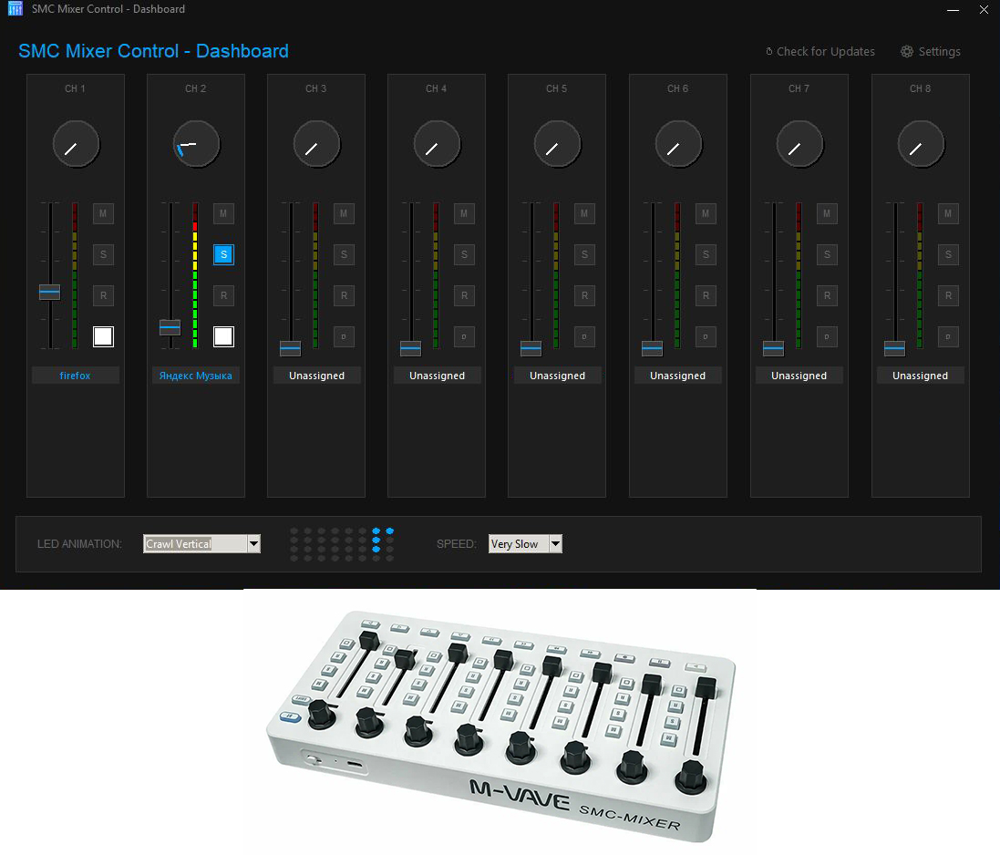

#  SMC Mixer Control

**SMC Mixer Control** is a professional, open-source Windows audio management utility designed specifically for MIDI controllers. It bridges the gap between your physical MIDI hardware and the Windows Volume Mixer, allowing you to control individual application volumes, system sounds, and output devices with precision and style.

---



---

## 🚀 Key Features

*   **🎧 Granular Volume Control**: Map any running application (Spotify, Discord, Games, etc.) to a physical fader or knob.
*   **🌈 Advanced LED Animations**: 11 dynamic modes that bring your controller to life, including a real-time **Equalizer** mode.
*   **💡 Event-Driven Feedback**: Hardware LEDs react instantly to your touch and system volume changes.
*   **🎯 Automated Mapping**: Automatically detects and assigns applications to your preferred channels based on your saved history.
*   **🛠️ Pro Tools in Tray**: Refresh app lists, open config folders, and switch animation modes without leaving your desktop.
*   **⚙️ Zero-Code Configuration**: Support new MIDI devices simply by adding a YAML file.

---

## 🛠️ Installation & Setup

### 1. Requirements
*   **Windows 10/11**
*   **Python 3.10+** (if running from source)
*   A MIDI Controller (optimized for **M-VAVE SMC-Mixer**)

### 2. Running from Source
1.  **Clone the repository**:
    ```powershell
    git clone https://github.com/degtev/smc_mixer_control.git
    cd smc_mixer_control
    ```
2.  **Create a Virtual Environment**:
    ```powershell
    python -m venv venv
    .\venv\Scripts\Activate.ps1
    ```
3.  **Install Dependencies**:
    ```powershell
    python.exe -m pip install --upgrade pip
    pip install -r requirements.txt
    ```

### 💡 Common Installation Issues (Windows)
If you see an error like `error: metadata-generation-failed` or `Unknown compiler(s)` while installing **python-rtmidi**:

1.  **Upgrade Pip**: Run `python.exe -m pip install --upgrade pip` first. This solves most issues by helping pip find pre-compiled wheels.
2.  **Missing C++ Build Tools**: If pip still tries to compile from source, you may need the [Visual Studio Build Tools](https://visualstudio.microsoft.com/visual-cpp-build-tools/) (Select "Desktop development with C++" in the installer).
3.  **Python Version**: This project is tested on Python 3.10 - 3.12 (64-bit).
    - If you have multiple versions (e.g., 3.14), use the Python launcher to force 3.12:
      ```powershell
      py -3.12 -m venv venv
      ```
    - **Avoid experimental versions** (like 3.14+) as they lack pre-compiled binary wheels for MIDI libraries.

4.  **Run the App**:
    ```powershell
    python main.py
    ```

### 3. Hardware Configuration (SMC-Mixer)
*   Ensure your device is in **CC Mode** (using the CubeSuite editor).
*   The application will automatically detect the device on startup.

---

## 🎮 How to Use

### 🖥️ Using the Dashboard
1.  Open the application; the **Dashboard** will appear (or restore it from the tray icon).
2.  **Assign Apps**: Click on any Fader, Knob, or Label to open the application picker.
3.  **Configure Buttons**: Click on any of the four buttons (M, S, R, ▢) next to a fader to set its specific function (Mute, Status, etc.) and target application.
4.  **Live Visualizer**: Watch the real-time LED grid at the bottom to see your animations and meter activity.
5.  **Settings**: Click the ⚙ icon in the header to manage MIDI ports and hardware profiles.

### 🖱️ Tray Menu & Quick Actions
*   Double-click the tray icon to quickly restore the Dashboard.
*   Right-click to access quick animation switching and preset refreshes.

### Visual Effects & Animations
You can change the look of your mixer under the **Visual Effects** menu:
*   **Equalizer**: LEDs mirror the volume levels of the system in real-time.
*   **Knight Rider**: A classic back-and-forth scanning effect.
*   **Chase**: A smooth light wave across the console.
*   **Speed**: Adjust the animation frequency from "Very Slow" to "Insane".

---

## 📂 Configuration & Migration

Settings are stored in: `%USERPROFILE%\.smc_mixer_control`

**Automatic Migration**: 
If you previously used *Havomi*, your configuration will be automatically migrated to the new `.smc_mixer_control` folder on the first run. No manual file moving required!

---

## 🔧 Troubleshooting

*   **Device not found**: Ensure no other MIDI software (like CubeSuite) is holding the MIDI port open.
*   **LEDs not lighting up**: Check if your device is in **CC Mode**.
*   **Volume not changing**: Ensure you have selected the correct application in the tray menu.

---

## 🏗️ For Developers

### Adding New Devices
Create a new `.yaml` file in `static/devices/`. Follow the structure of `smc_mixer.yaml` to define Note IDs and CC mappings for your specific hardware.

### Building an Executable
To generate a standalone Windows `.exe`:
1.  **Install build tools**:
    ```powershell
    pip install pyinstaller
    ```
2.  **Run the build script**:
    ```powershell
    .\scripts\build.bat
    ```
3.  **Output**: Find your standalone app in the `dist/` folder.

---

## 🤝 Contributing
Contributions make the open-source community an amazing place!
1. Fork the Project.
2. Create your Feature Branch (`git checkout -b feature/AmazingFeature`).
3. Commit your Changes (`git commit -m 'Add some AmazingFeature'`).
4. Push to the Branch (`git push origin feature/AmazingFeature`).
5. Open a Pull Request.
